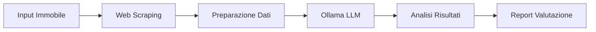

# 🤖 KeyAbita AI - Sistema di Valutazione Immobiliare

## 🎯 Per Chi Non è Tecnico
KeyAbita AI è un assistente intelligente che aiuta a valutare gli immobili in modo rapido e preciso. Immagina di avere un esperto del mercato immobiliare sempre disponibile, che può analizzare migliaia di dati in pochi secondi per darti una valutazione accurata.

### Come Funziona (Spiegazione Semplice)
1. **Raccolta Informazioni**
   - Inserisci i dati dell'immobile (città, metratura, condizioni, etc.)
   - Il sistema raccoglie automaticamente i prezzi di mercato della zona
   - Analizza le tendenze del mercato immobiliare locale

2. **Analisi Intelligente**
   - L'AI confronta l'immobile con migliaia di casi simili
   - Considera fattori come la posizione, i servizi vicini, i trend di mercato
   - Calcola un prezzo equo basato su dati reali

3. **Sistema di Valutazione Dual-Step**
   
   📱 **Valutazione Preliminare Istantanea**
   - Stima immediata basata su AI in tempo reale
   - Analisi rapida dei dati di mercato essenziali
   - Range di prezzo indicativo
   - Ideale per decisioni rapide e primi contatti con i clienti
   
   📊 **Valutazione Professionale (entro 72 ore)**
   - Report dettagliato e approfondito
   - Analisi completa del mercato con grafici e proiezioni
   - Valutazione precisa basata su algoritmi avanzati
   - Confronto con immobili simili nella zona
   - Suggerimenti per strategia di vendita

### Perché Usarlo?

#### 👥 Per Digital Strategist
- **Contenuti Automatici**: Genera descrizioni professionali degli immobili
- **Analisi di Mercato**: Dati e trend per le tue strategie di marketing
- **Target Preciso**: Suggerimenti per il pubblico più interessato
- **Social Media**: Contenuti pronti per post e stories
- **Lead Generation**: Identificazione delle proprietà più promettenti

#### 🎨 Per Frontend Developer
- **Dashboard Intuitive**: Visualizzazione dati già strutturata
- **Template Pronti**: Components React/Vue per mostrare le valutazioni
- **API Semplice**: Endpoints facili da integrare
- **Design System**: Compatibile con Material-UI e altri framework
- **Responsive**: Adatto a mobile e desktop

#### 💼 Per Agenti Immobiliari
- **Valutazioni Veloci**: Risparmio di tempo nelle stime
- **Dati Affidabili**: Prezzi basati sul mercato reale
- **Report Professionali**: Documenti pronti da presentare ai clienti
- **Analisi Competitive**: Confronto con immobili simili
- **Supporto Decisioni**: Suggerimenti per strategie di vendita

### Vantaggi Principali

1. **Risparmio di Tempo** ⏰
   - Valutazioni in 72 ore invece di settimane
   - Generazione automatica di report
   - Aggiornamenti in tempo reale

2. **Precisione** 🎯
   - Analisi di migliaia di dati
   - Considerazione di tutti i fattori di mercato
   - Aggiornamento costante dei prezzi

3. **Facilità d'Uso** 💡
   - Interface intuitiva
   - Nessuna competenza tecnica richiesta
   - Report facili da capire

4. **Supporto Marketing** 📢
   - Contenuti SEO-friendly
   - Materiale per social media
   - Analisi del target

### Come Iniziare

1. **Primo Accesso**
   - Registrati sulla piattaforma
   - Completa il profilo aziendale
   - Guarda il video tutorial di 5 minuti

2. **Prima Valutazione**
   - Inserisci i dati base dell'immobile
   - Carica alcune foto
   - Attendi il report automatico

3. **Utilizzo Quotidiano**
   - Dashboard personalizzata
   - Notifiche su mobile
   - Supporto clienti disponibile

### Sistema di Valutazione Rapida vs Professionale

#### ⚡ Valutazione Rapida (Immediata)
La valutazione rapida utilizza l'AI per fornire una prima stima istantanea, ideale per:
- Primi incontri con potenziali clienti
- Decisioni preliminari di investimento
- Screening iniziale delle proprietà
- Negoziazioni veloci

**Come Funziona:**
1. Inserisci i dati base dell'immobile
2. Ricevi in 30 secondi:
   - Range di prezzo stimato
   - Confronto rapido con mercato
   - Indicatori di tendenza zona

#### 🎯 Valutazione Professionale (72 ore)
La valutazione completa fornisce un'analisi approfondita per:
- Decisioni di investimento importanti
- Documentazione bancaria
- Strategie di vendita a lungo termine
- Analisi dettagliata del mercato

**Processo Completo:**
1. Analisi approfondita dei dati
2. Verifica storica prezzi zona
3. Valutazione competitors
4. Report completo con proiezioni

### Esempi Pratici

```markdown
🏠 Caso Studio: Appartamento in Centro

**Valutazione Rapida (30 secondi)**
Input:
- 100mq in zona centrale
- Anno: 2010
- Piano: 2° con ascensore

Output Immediato:
- Range Prezzo: €290.000 - €350.000
- Trend Mercato: In crescita
- Tempo Medio Vendita: 3-4 mesi

Input:
- 100mq in zona centrale
- Costruzione del 2010
- Secondo piano con ascensore

**Valutazione Professionale (72 ore)**
- Prezzo Consigliato: €320.000 (±5%)
- Report dettagliato di 10 pagine
- Analisi comparativa con 20 immobili simili
- Studio demografico della zona
- Previsioni di mercato a 12 mesi
- Piano marketing personalizzato
- Strategia di vendita ottimale
- Suggerimenti per valorizzazione immobile
```

### Assistenza e Supporto

- Chat dal vivo per dubbi tecnici
- Video tutorial per ogni funzione
- Guide PDF scaricabili
- Webinar mensili di aggiornamento

---

## Panoramica Tecnica
KeyAbita implementa un sistema di valutazione immobiliare automatizzato utilizzando Ollama, un LLM (Large Language Model) open source. Il sistema combina l'analisi dei dati di mercato in tempo reale con l'intelligenza artificiale per fornire valutazioni accurate degli immobili.

## 🏗️ Architettura AI

### 1. Componenti Principali
```
com.keyabita.ai/
├── config/
│   └── OllamaConfig.java         # Configurazione client Ollama
├── service/
│   ├── ValutazioneService.java   # Logica principale valutazione
│   ├── WebScrapingService.java   # Raccolta dati mercato
│   └── AIModelService.java       # Interfaccia con Ollama
└── model/
    ├── ValutazioneRequest.java   # DTO richiesta
    └── ValutazioneResponse.java  # DTO risposta
```

### 2. Flusso Dati


## 🔧 Setup Tecnico

### 1. Installazione Ollama
```bash
# Windows (PowerShell)
curl.exe -o ollama-installer.exe https://ollama.ai/download/ollama-installer.exe
./ollama-installer.exe

# Linux
curl -fsSL https://ollama.ai/install.sh | sh
```

### 2. Configurazione Model
```bash
# Pull del modello LLaMA2
ollama pull llama2

# Avvio del servizio
ollama serve
```

### 3. Configurazione Application Properties
```properties
# Ollama Configuration
ollama.base.url=http://localhost:11434
ollama.model=llama2
ollama.timeout=30000
ollama.max-tokens=2048
```

## 💻 Implementazione

### 1. Configurazione Client
```java
@Configuration
public class OllamaConfig {
    @Value("${ollama.base.url}")
    private String baseUrl;
    
    @Bean
    public OllamaClient ollamaClient() {
        return new OllamaClient(baseUrl);
    }
}
```

### 2. Web Scraping Service
```java
@Service
public class WebScrapingService {
    public Map<String, Object> raccogliDatiMercato(String citta, String zona) {
        // Raccolta dati da:
        // - Immobiliare.it
        // - Idealista
        // - Casa.it
        return datiMercato;
    }
}
```

### 3. Prompt Engineering
```java
private String creaPromptValutazione(ImmobileDTO immobile, Map<String, Object> datiMercato) {
    return """
        Analizza questi dati per una valutazione immobiliare:
        
        DATI IMMOBILE:
        Città: %s
        Zona: %s
        Superficie: %d mq
        Stato: %s
        Anno: %d
        
        DATI MERCATO:
        Prezzo medio zona: €%d/mq
        Trend mercato: %s
        
        Fornisci:
        1. Valutazione in euro
        2. Analisi dettagliata
        3. Confronto mercato
        """.formatted(/* parametri */);
}
```

## 📊 Pipeline di Valutazione

1. **Raccolta Dati**
   - Caratteristiche immobile
   - Prezzi di mercato zona
   - Trend storico vendite
   - Indicatori economici locali

2. **Preprocessamento**
   - Normalizzazione dati
   - Validazione input
   - Arricchimento contesto

3. **Analisi AI**
   - Elaborazione LLM
   - Confronto benchmark
   - Calcolo valutazione

4. **Post-processing**
   - Validazione output
   - Formattazione report
   - Generazione insights

## 🔍 Features Avanzate

### 1. Market Analysis
- Trend prezzi storici
- Analisi comparativa zona
- Previsioni mercato

### 2. Report Generation
- Valutazione dettagliata
- Grafici e statistiche
- Raccomandazioni

### 3. Continuous Learning
- Feedback loop
- Aggiornamento modello
- Miglioramento accuracy

## ⚙️ Parametri di Valutazione

```json
{
  "parametri_immobile": {
    "location": {
      "citta": "string",
      "zona": "string",
      "indirizzo": "string"
    },
    "caratteristiche": {
      "superficie": "number",
      "locali": "number",
      "bagni": "number",
      "piano": "number"
    },
    "condizioni": {
      "stato": "string",
      "anno_costruzione": "number",
      "classe_energetica": "string"
    }
  },
  "parametri_mercato": {
    "prezzo_medio_zona": "number",
    "trend_mercato": "string",
    "tempo_medio_vendita": "number"
  }
}
```

## 🚀 Roadmap

### Fase 1: MVP
- [x] Setup Ollama
- [x] Implementazione base API
- [x] Web scraping base
- [ ] Valutazione semplice

### Fase 2: Enhancement
- [ ] Fine-tuning modello
- [ ] Report avanzati
- [ ] Dashboard analytics
- [ ] API documentazione

### Fase 3: Scale
- [ ] Load balancing
- [ ] Caching sistema
- [ ] Batch processing
- [ ] Real-time updates

## 📈 Metriche di Performance

- Accuratezza valutazione: ±10%
- Tempo risposta: < 30s
- Disponibilità: 99.9%
- Precisione dati: 95%

## 🔒 Security & Privacy

- Dati personali criptati
- API authentication
- Rate limiting
- Audit logging